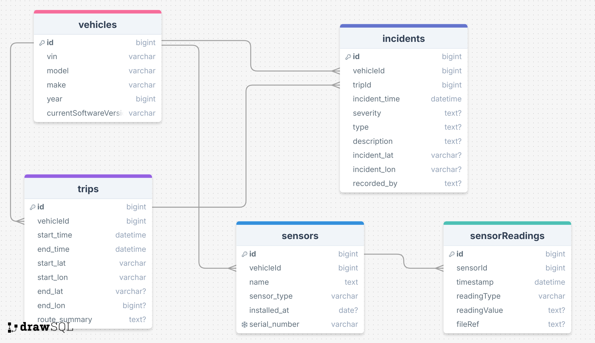

# Natural Language SQL Project with ChatGPT

## Project Description
This project is an implementation of the Natural Language LM prompting techniques from Chang, Shuaichen, and Eric Fosler-Lussier. ["How to prompt llms for text-to-sql: A study in zero-shot, single-domain, and cross-domain settings."](https://arxiv.org/abs/2305.11853). It implements the three methods of prompting described in the paper: zero-shot, few-shot single domain, and few-shot cross-domain. This implementation is simple and naive, focusing only on understanding the concepts and not on improving research in this field. 

## Dummy Database
The database used in this project is a dummy database filled with fake information about self-driving cars, trips, incidents, and sensors. Example natural language questions that the database can answer include:
- How many incidents occurred between `x` and `x`?
- Find all incidents involving Lidar and tell me which cars were involved.
- Find the most common cause of incidents in the winter.

The database is pretty small so not all questions will have a good answer.


## Results
### Example That Didn't Work
```
Enter your question about the self-driving car database: Find what season of the year involved the most incidents with animals.
Attempting zero-shot SQL query generation...
Generated SQL Query:
SELECT season, COUNT(*) AS incident_count
FROM (
  SELECT
    CASE
      WHEN EXTRACT(MONTH FROM CAST(incident_time AS TIMESTAMP)) IN (12,1,2) THEN 'winter'
      WHEN EXTRACT(MONTH FROM CAST(incident_time AS TIMESTAMP)) IN (3,4,5) THEN 'spring'
      WHEN EXTRACT(MONTH FROM CAST(incident_time AS TIMESTAMP)) IN (6,7,8) THEN 'summer'
      WHEN EXTRACT(MONTH FROM CAST(incident_time AS TIMESTAMP)) IN (9,10,11) THEN 'autumn'
    END AS season
  FROM incidents
  WHERE LOWER(COALESCE(type, '')) LIKE '%animal%' OR LOWER(COALESCE(description, '')) LIKE '%animal%'
) AS seasons
GROUP BY season
ORDER BY incident_count DESC
LIMIT 1;

Executing the query...
An error occurred: near "FROM": syntax error
Took 20250926-113017 - 20250926-113008 seconds
```

### Example that Worked
```
Enter your question about the self-driving car database: Find what season of the year involved the most incidents with animals.
Attempting cross-domain few-shot SQL query generation...
Generated SQL Query:
SELECT CASE
    WHEN CAST(strftime('%m', incident_time) AS INTEGER) IN (12,1,2) THEN 'winter'
    WHEN CAST(strftime('%m', incident_time) AS INTEGER) IN (3,4,5) THEN 'spring'
    WHEN CAST(strftime('%m', incident_time) AS INTEGER) IN (6,7,8) THEN 'summer'
    WHEN CAST(strftime('%m', incident_time) AS INTEGER) IN (9,10,11) THEN 'fall'
END AS season,
COUNT(*) AS incident_count
FROM incidents
WHERE lower(type) LIKE '%animal%' OR lower(description) LIKE '%animal%'
GROUP BY season
ORDER BY incident_count DESC
LIMIT 1;

Executing the query...
Query Results:
('summer', 958)

Natural Language Summary of Results:
Summer had the most incidents involving animals, with 958 incidents.
Took 20250926-113053 - 20250926-113041 seconds
```

### Additional Examples
View the rest of the example questions and their responses [here](Examples.md).

### Conclusion
Of the three prompting strategies, the most consistently successful was the *few-shot cross domain* prompt. It seemed to help ChatGPT make the most consistent syntax and return the correct results. On the other hand, the least consistent prompting strategy was the *few-shot single domain* prompt. It never returned a correct SQL query in all of the times that it was run.